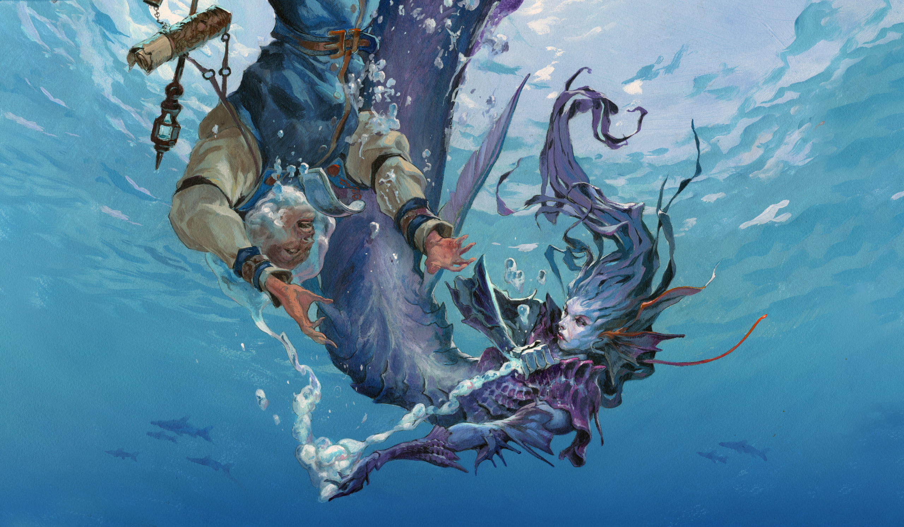

# Fidelitty

### A library for renderieng images in the terminal

- Compatible with all modern terminals
- Functions over ssh, doubling as a form of image compression enabling video to be transmit in realtime
- Runs comfortably at > 60fps
- Available as a Zig library or shared object with C header

<p align="center">
  
  
</p>

<p align="center">
Some of my favorite art from Jesper Ejsing, rendered with fidelitty.
</p>

#### Dependencies

Vulkan and fontconfig are the only dependencies. Zig `0.16` is needed to build from source.

#### Building from source

Clone the repo:
```bash
git clone https://github.com/aaronbanse/fidelitty.git
cd fidelitty
```

To build and run the example:
```bash
zig build example
```

To build and install:
```bash
zig build -Doptimize=ReleaseSmall --prefix /usr/local
# -Doptimize=ReleaseFast is also an option, but the binary will be ~10x larger.
# Furthermore, most of the latency is on the gpu, where that build setting does not help.
```

To use as a Zig library:
```bash
# in project root
zig fetch --save https://github.com/aaronbanse/fidelitty.git
```

#### Algorithm overview

##### Output Format

While Kitty allows for high-resolution image rendering using their protocol, this tool attempts to provide a method for image rendering targeting a more wide range of terminals.
Most modern terminals allow for setting the foreground and background colors of characters using escape sequences, and we use this as the foundation for the algorithm.

While one can turn down the font size to the minimum in order to get a higher resolution image using the full-block character ```0x2588``` or a 2-colored half-block unicode character ```0x2580```, this makes the image renderer unusable alongside other text-based terminal apps. This defeats the purpose of integrated terminal graphics, as you would be better off just opening another window with a real graphics API. 

Hence, we are restricted to rendering images without changing the font size. On my terminal with font size 10, I can fit ~9000 (160x51) characters ('pixels') on the screen. Using half-block characters with foreground and background color set, we can double the resolution to ~18000 (160x102) pixels. This isn't terrible, but we can do better.

While we can't increase our 'color resolution' (the number of distinct colored patches we can fit on the screen) past 18000 pixels, since we are limited to setting the foreground and background color for a given character, we *can* increase the 'shape resolution'.

##### Patch Matching

The main idea of this algorithm is to render our 'virtual' image to a higher resolution then the effective terminal resolution, say 640x320. This gives us a 4x4 patch of pixels for each character in the terminal window. We then assign a pair of colors and a character to each patch that best matches the patch visually.

But how? 

First we construct a metric to compare how well a unicode character matches a given 4x4 rgb patch. Given that we can color the foreground and background, a rendered unicode character serves as a partition of a terminal cell into two colors. In particular, the unicode glyphs are rendered with anti-aliasing, and we store them in a highly compressed 4x4 array of floats in the range [0,1]. We can also derive a mask of the *negative* space of a glyph by subtracting the array from an array of all 1's.

We store patches as flat vectors, since the position of pixels is only relevant for pointwise comparison. For comparison, we define a *Unicode Pixel* as foreground and background colors $C_f, C_b$, and foreground and background mask vectors $F, B$ with each $F_i,B_i \in [0,1]$. We define a *Image Patch* as a set of 3 vectors $P_r,P_g,P_b$.

This algorithm considers each color channel individually, and so the remainder of this section will present the metric to compare the difference between the Unicode Pixel and the Image Patch *over one channel*, $P$.

We will measure the difference $D$ using mean squared error (MSE):

```math
D = \sum_i (P_i - c_fF_i - c_bB_i)^2
```

Where $c_f, c_b$ are scalars, since we only consider one channel. For a given unicode character and patch, the glyph masks are fixed, so we want to find the values of $c_f$ and $c_b$ that minimize $D$. We find where the partial derivative of $c_f$ and $c_b$ are $0$:

```math
0 = \sum_i -2F_i(P_i - c_fF_i - c_bB_i)
```
```math
0 = \sum_i -2B_i(P_i - c_fF_i - c_bB_i)
```
```math
0 = -F\cdot (P - c_fF - c_bB)
```
```math
0 = -B\cdot (P - c_fF - c_bB)
```
Then, some algebra:
```math
P\cdot F = c_fF\cdot F + c_bF\cdot B
```
```math
P\cdot B = c_fF\cdot B + c_bB\cdot B
```
```math
\begin{bmatrix} P\cdot F \\ P\cdot B \end{bmatrix} = \begin{bmatrix} F\cdot F & F\cdot B \\ F\cdot B & B\cdot B \end{bmatrix} \begin{bmatrix} c_f \\ c_b \end{bmatrix}
```
```math
\begin{bmatrix} F\cdot F & F\cdot B \\ F\cdot B & B\cdot B \end{bmatrix}^{-1} \begin{bmatrix} P\cdot F \\ P\cdot B \end{bmatrix} = \begin{bmatrix} c_f \\ c_b \end{bmatrix}
```
```math
\frac{\begin{bmatrix} B\cdot B & -F\cdot B \\ -F\cdot B & F\cdot F \end{bmatrix}}{F\cdot F*B\cdot B - (F\cdot B)^2} \begin{bmatrix} P\cdot F \\ P\cdot B \end{bmatrix} = \begin{bmatrix} c_f \\ c_b \end{bmatrix}
```

Finally, we have an equation for the optimal $c_f,c_b$. To see how good it is, we plug these values into the first equation for D. Now that we have this metric, finding the optimal unicode pixel is as simple as looping through the full list of characters, computing this value for each channel, and picking the character-color combo with the lowest $D$.
