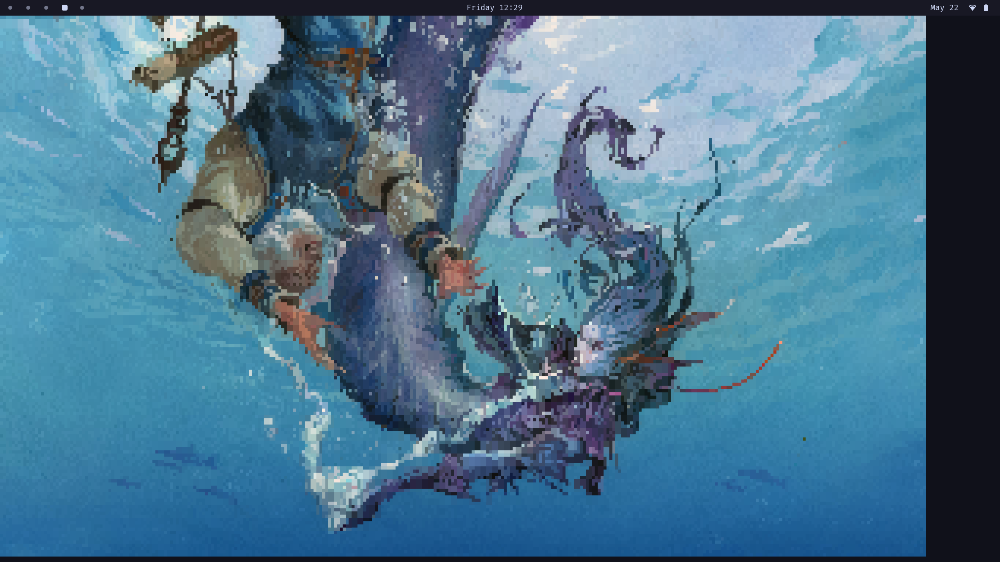

# Fidelitty

### A library for rendering images in the terminal

- Functions over ssh
- Doubles as a form of image compression, enabling video to be transmit efficiently
- Can run at > 120fps with a lower resolution (2x4 pixels per terminal cell)
- Compatible with all modern terminals supporting truecolor, font fallbacks, and escape sequences for coloring the foreground and background
- Available as a Zig library or shared object with C header

<p align="center">
  
</p>

<p align="center">
  <em>Example render with resolution 3x5 per cell.</em>
</p>

<p align="center">
  
</p>

<p align="center">
  <em>Example render with resolution 2x4 per cell.</em>
</p>

<p align="center">
  
</p>

<p align="center">
  <em>The original image, one of my favorite works from Jesper Ejsing.</em>
</p>

#### Dependencies

Vulkan and fontconfig are the only dependencies. Zig `0.16` is needed to build from source.

#### Building from source

Clone the repo:
```bash
git clone https://github.com/aaronbanse/fidelitty.git
cd fidelitty
```

To build and run the example (after completing setup, see below):
```bash
zig build example
```

To build and install:
```bash
zig build -Doptimize=ReleaseSmall --prefix /usr/local
# -Doptimize=ReleaseFast is also an option, but the binary will be ~10x larger.
# Furthermore, most of the latency is on the gpu, where that build setting does not help.
```

To use as a Zig library:
```bash
# in project root
zig fetch --save https://github.com/aaronbanse/fidelitty.git
```
#### Setup

Fidelitty uses a custom bitmask font for rendering which must match the terminal cell dims exactly. The dimensions of the terminal cell are determined by the user's default font. To generate the rendering font, run:

```bash
ftty-init <path_to_user_font>
fc-cache -f
```

Terminals cache available fonts on startup, so you must restart your terminal for the changes to be detected.

#### Algorithm overview

##### Output Format

While Kitty allows for high-resolution image rendering using their protocol, this tool attempts to provide a method for image rendering targeting a more wide range of terminals.
Most modern terminals allow for setting the foreground (fg) and background (bg) colors of characters using escape sequences, and we use this as the foundation for the algorithm.

While one can turn down the font size to the minimum in order to get a higher resolution image using the full-block character ```0x2588``` or a 2-colored half-block unicode character ```0x2580```, this makes the image renderer unusable alongside other text-based terminal apps. This defeats the purpose of integrated terminal graphics, as you would be better off just opening another window with a real graphics API. 

Hence, we are restricted to rendering images without changing the font size. On my terminal with font size 10, I can fit ~9000 (160x51) characters ('pixels') on the screen. Using half-block characters with ff and bg color set, we can double the resolution to ~18000 (160x102) pixels. This isn't terrible, but we can do better.

While we can't increase our 'color resolution' (the number of distinct colored patches we can fit on the screen) past 18000 pixels, since we are limited to setting the fg and bg color for a given character, we *can* increase the 'shape resolution'.

##### Patch Matching

The main idea of this algorithm is divide the image into terminal-cell-sized patches, and assign a pair of colors and a unicode character to each patch that best matches the patch visually.

*But how?*

Given that we can color the foreground and background, a rendered unicode character partitions the cell into two colors. If we quantize the cell with resolution $n \times m$, we can represent each side of the partition as a binarized vector of length $nm$. Given a unicode glyph $G$, let $F,B$ be the foreground and background mask vectors, respectively. Note that since $F$ and $B$ partition $G$, $F \cdot B = 0$.

We sample the corresponding patch in the input image down to matching dimensions $n \times m$, yielding three vectors $P_r, P_g, P_b$ of length $nm$. 

Let us consider one of these channels out of $P_r, P_g, P_b$, call it $P$. We want to find the values $c_f, c_b$, representing that channel of the fg and bg colors of the terminal cell, such that $P$ is as similar as possible to $c_fF + c_bB$. In other words, we want to find the fg and bg colors such that the rendered unicode character best matches the patch in that channel. We will use mean squared error as our difference metric, so we have:

```math
D = \sum_i(P_i - c_fF_i - c_bB_i)^2
```

Where we seek to minimize $D$. To do so, we take the derivative w.r.t $c_f$ and $c_b$, yielding:

```math
0 = \sum_i -2F_i(P_i - c_fF_i - c_bB_i)
```
```math
0 = \sum_i -2B_i(P_i - c_fF_i - c_bB_i)
```

The sum of the pointwise product is the dot product, so:

```math
0 = F \cdot (P - c_fF - c_bB)
```
```math
0 = B \cdot (P - c_fF - c_bB)
```
Then, some algebra:
```math
c_fF\cdot F + c_bF\cdot B = P\cdot F
```
```math
c_fF\cdot B + c_bB\cdot B = P\cdot B
```
```math
\begin{bmatrix} F\cdot F & F\cdot B \\ F\cdot B & B\cdot B \end{bmatrix} \begin{bmatrix} c_f \\ c_b \end{bmatrix} = \begin{bmatrix} P\cdot F \\ P\cdot B \end{bmatrix}
```
```math
\begin{bmatrix} c_f \\ c_b \end{bmatrix} = \begin{bmatrix} F\cdot F & F\cdot B \\ F\cdot B & B\cdot B \end{bmatrix}^{-1} \begin{bmatrix} P\cdot F \\ P\cdot B \end{bmatrix}
```
```math
\begin{bmatrix} c_f \\ c_b \end{bmatrix} = \frac{\begin{bmatrix} B\cdot B & -F\cdot B \\ -F\cdot B & F\cdot F \end{bmatrix}}{F\cdot F*B\cdot B - (F\cdot B)^2} \begin{bmatrix} P\cdot F \\ P\cdot B \end{bmatrix}
```

Finally, we have an equation for the optimal $c_f,c_b$. To find the 'reconstruction error', we plug these values into the first equation for D. Now that we have this metric, finding the optimal unicode pixel is as simple as looping through the full list of characters, computing this value for each channel, and picking the character-color combo with the lowest $D$.

#### Custom rendering font

Given a set of unicode characters, increasing the resolution of the cell we compute the optimal fg and bg colors with yields diminishing returns. The number of unique partitions of the cell we can represent is limited to that set.

To solve this, fidelitty defines a custom font, with codepoints occupying the Private Use Area (PUA) of the spectrum of values a codepoint can take. Unicode only uses values up through the max of an unsigned, 21-bit integer, leaving $2^{21}$ times more codepoints open for users to define. This allows us to create a font which will not conflict with any other fonts. When we tell the terminal to print a codepoint in that range, we can assume the glyph will be sourced from the fidelitty font, even if the user's default font is different, since the terminal will 'fallback' if the default font does not define that codepoint.

This custom font allows us to ensure all possible partitions of the cell are represented in the set. Given cell resolution $2 \times 4$, this is $2^8 = 256$ different glyphs; given resolution $3 \times 5$, this is $2^15 = 32768$. Rendering at higher resolution demands exponentially larger glyph sets, and so exponentially more time to solve for each cell. However, since the inverse of each glyph is an equivalent partition, we can cut the size in half with no effect on correctness.

This set could be reduced further in the hopes that not all partitions are as important, allowing you to trade generally higher resolution for the occasional artifact when a patch doesn't have a good match. This is an area of open research, and would be helpful to allow us to render at higher resolution while maintaining a reasonable framerate. Currently, the only resolution yielding square-ish pixels that can easily run on my machine is $2 \times 4$. For standalone image renders, $3 \times 5$ is best.
